# Task-Memo: 詳細ドキュメント

[Task-Memo](https://www.task-memo.com/)は日常のタスク管理を効率化し、  
直感的な操作性を実現するために開発したアプリケーションです。
> コスト削減を目的に、一般的な業務時間である平日9〜18時に稼働を限定しています。  
> AWSのStep Functionsを用いてECSとRDSを自動的に停止・再起動する仕組みを構築しています。

**認証機能やドラッグ＆ドロップによるタスク並び替え**など、  
効率的なタスク管理をサポートする機能を搭載しています。

このアプリは、**未経験からの転職を目指し実践的なスキルを身につける**ため、  
モダンな技術スタックを活用して一つのアプリを作り切ることを目標に開発しました。

実務でのチーム開発を想定し、RailsとReactを組み合わせたモノレポ構成での開発に挑戦しています。    
同様に、インフラもAWSでの構築に挑戦しました。

本ドキュメントはエンジニア向けに全体的な機能と技術的な詳細を記載しています。  
人事担当者や非エンジニア向けの[概要ドキュメント](../README.md)はこちら。

## 目次
- [機能一覧](#機能一覧)
- [開発環境](#開発環境)
- [フロントエンド](#フロントエンド)
- [バックエンド](#バックエンド)
- [インフラ](#インフラ)
- [アプリ画面](#アプリ画面)
- [開発記録](#開発記録) 

## 機能一覧
タスク管理アプリに求められる基本的な機能を導入しています。  
実際の動作イメージは[アプリ画面](#アプリ画面)から確認ください。
### 認証
- ユーザー登録
- メールアドレス認証（認証メール再送信、未認証ユーザー削除）
- ログイン、ログアウト（Cookie、セッション管理）
- ゲストログイン
- パスワードリセット（リセットメール認証）
### タスク管理
- 作成、表示、更新、削除
- ボード（タスクグループ）管理
- タスクの検索、絞り込み
- 並び替え（ドラッグ＆ドロップ対応、状態保持）

## 開発環境
### プロジェクト全体のディレクトリ構成
```plaintext
project/
├── .vscode/                # 開発環境の設定
│   ├── settings.json       # VSCodeのエディタ設定
├── api/                    # バックエンド (Rails)
│   ├── Gemfile             # 依存関係管理
│   └── app/                # Railsのアプリケーションコード
├── front/                  # フロントエンド (React)
│   ├── package.json        # 依存関係管理
│   └── src/                # Reactのアプリケーションコード
├── docs/                   # ドキュメント管理
│   └── README.md           # プロジェクトの詳細ドキュメント
├── docker-compose.yml      # 開発環境の統一管理
└── README.md               # プロジェクトの概要ドキュメント
```
### 技術選定・構成の理由
プロジェクト全体の主なディレクトリ構成は以下のとおりです。  
本プロジェクトは個人開発ですが、**Docker-Compose**でフロントエンドとバックエンドを統一管理する**モノレポ構成**で開発を進めました。  
実務でのチーム開発を見据え、以下のような効率的な開発環境の構築を目標に挑戦しています。

#### Dockerによる開発環境の統一化
Dockerは開発環境をコンテナとして管理し、ローカルから分離した状態で軽量に実行できるツールです。  
統一された開発環境を容易に共有でき、開発効率が大幅に向上するため採用しました。  
以下のように効率的なセットアップを実現しています。
 - **環境の一貫性**  
   フロントエンド（React）とバックエンド（Rails）に個別のDockerファイルを作成。  
   将来的なチーム開発における **「自分の環境では動く」といった問題** を防止。  
   本番環境では、Dockerファイルから作成したイメージをECRに格納し、AWS ECSでコンテナをデプロイ。  
   ローカル環境と同一の構成を本番でも再現し、環境間の一貫性を保持。
 - **環境構築の効率化**  
   Docker Composeによって一元的にアプリを起動・管理できる仕組みを整え、環境構築にかかる時間を短縮。

#### モノレポ構成による明確な役割分担とコードベースの一元化
モノレポ構成では、一つのリポジトリ内で複数の技術スタックコードを一元管理します。  
本プロジェクトは、異なる技術スタックのバックエンド（Rails）とフロントエンド（React）のコードを個別に作成。    
両者を同一リポジトリに集約し、以下のようにメンテナンス性を向上させています。
- **役割分担の明確化**  
  フロントエンド（`front/`）はUI/UX設計とクライアント側のロジックを担い、バックエンド（`api/`）はAPI設計とデータ処理を担当。  
  技術スタックごとに分離された構造により、それぞれの開発やメンテナンスが容易。
 - **プロジェクト全体の変更管理の効率化**  
  バックエンドAPIのエンドポイント設計の更新時に、フロントエンド側で必要な修正箇所を同リポジトリ内で即座に確認可能。  
  リポジトリを1つに統一することで、複数のリポジトリを行き来する必要がなく、開発効率が向上。

## フロントエンド
本プロジェクトのフロントエンドは、TypeScriptとReactを使用し、モダンな設計と高速なユーザー体験の実現を目指しました。  
また、UIはChakra UIを活用し、ユーザーフレンドリーで統一感のあるデザインを心がけています。  
ビルドツールにはViteを採用し、開発効率と高速なホットリロードを実現しています。 

### 使用技術
今回のプロジェクトでは、フロントエンドのモダンな技術を試して一つのアプリを作り切ること目標にしました。  
TypeScriptやReact、Chakra UIなど、現在多くの開発現場で採用されている技術を調査し、プロジェクトに取り入れました。  
今後は要件に応じて最適な技術を選定できるよう、さらに知識を深めたいと考えています。
 
- **TypeScript (5.5.3)**  
  静的型付けにより型エラーを未然に防止し、コードの保守性を向上。  
  IDEの補完機能が充実しており、開発効率が向上。
- **React (18) ＋ React Router Dom (6.26.1)**  
  コンポーネントベースの設計で再利用性が高く、SPAのページ遷移を実現。  
  SPAによって直感的な操作性を提供。
- **Chakra UI (2.10.1)**  
  デザインの一貫性を確保しつつ、短期間でモダンなUIを構築。
- **React Hook Form (7.53.1) + Yup (1.4.0)**  
  軽量なフォーム管理とスキーマベースのバリデーションにより、簡潔かつ効率的なフォーム実装を実現。
- **ESLint / Prettier / Stylelint**  
  コード品質の維持とスタイル統一を実現し、メンテナンス性を向上。
- **Vite (5.4.8)**  
  ビルド速度とホットリロード性能を重視し、開発効率を向上。

### フロントエンドのディレクトリ構成
本プロジェクトでは、Reactの自由度の高いディレクトリ設計に対し、保守性と拡張性を重視して**アトミックデザイン**を採用しました。  
アトミックデザインは、コンポーネントを「再利用可能なUI部品」として階層的に整理し、機能の拡張や長期的なメンテナンスを容易にするアプローチです。

```plaintext
src/
├── App.tsx             # アプリのメインコンポーネント
├── components/         # UIコンポーネント（アトミックデザインに基づく構成）
│   ├── atoms/          # 最小単位のコンポーネント（ボタン、入力フィールドなど）
│   ├── ecosystems/     # より高度な機能を組み合わせた複合コンポーネント
│   ├── environments/   # コンポーネントの特定環境設定やデザインの切り替え
│   ├── molecules/      # Atomsを組み合わせたやや複雑なコンポーネント（入力フォームなど）
│   ├── organisms/      # Moleculesを組み合わせた機能単位のコンポーネント（ナビゲーションバーなど）
│   └── templates/      # ページ構成に使うテンプレート（ページの枠組みなど）
├── features/           # アプリケーションの特定の機能（認証など）
├── main.tsx            # アプリのエントリーポイント
├── routes/             # ルーティング関連の設定
├── urls/               # APIやリンクのURL管理
└── utils/              # ユーティリティ関数やAPIリクエスト関連
```
#### 主なフォルダ構成と役割
- components  
  アトミックデザインの考え方をベースにコンポーネントを階層的に管理。
- features  
  認証など、アプリケーションの主要機能を集約。  
- utils  
  APIリクエストや汎用的な関数を集約し再利用性を向上。
- urls  
  API関連のルーティング設定を一元管理し、再利用性を向上。
  
この構成により、UIとロジックが分離され、機能ごとに整理された効率的な開発環境を実現しました。  
将来的な機能追加や変更にも柔軟に対応できる設計を心がけています。

### 今後の課題
フロントエンドのテストは実際の画面操作により行いました。  
本来はJestなどのライブラリを使用しテストを行うべきですが、学習コストと開発速度のバランスを考慮し、現在は未導入としています。  
今後はフロントエンド機能自体のブラッシュアップを行うとともに、Jestによるテスト方法を学習し実装します。

## バックエンド
フロントエンドで初めての技術を使うため、バックエンドの方は開発経験があるRailsを選定しました。  
また、実際の現場でもReact×Railsによる開発が行われているため、今後の実務に活かせる組み合わせと考え採用しました。

### 使用技術
広く普及しており、技術記事を参照しやすい技術を使用しています。
- **Rails (7.1.4)**  
  RubyによるMVCアーキテクチャで開発効率が高く、認証やバリデーションを短期間で実装可能。
- **MySQL (mysql2 ~> 0.5)**  
  高速なデータ処理と安定性を重視し、簡潔な運用が可能なリレーショナルデータベース。
- **Devise (4.9.4) ＋ Devise Token Auth (1.2.3)**  
  トークンベースの認証をサポートし、SPAでセキュアなAPI通信を実現。
- **AWS Secrets Manager (1.108.0)**  
  MySQLのパスワードやAPIキーを動的に管理し、セキュリティと運用効率を向上。
- **Rack CORS (2.0.2)**  
  フロントエンドとバックエンドを安全に連携させるためのCORS（クロスオリジンリソース）設定を管理。

### データベース構造
図の作成にはdbdiagram.ioを使用しました。  
schema.rbを貼り付けるだけで図を自動生成できるため、効率的に作成できました。
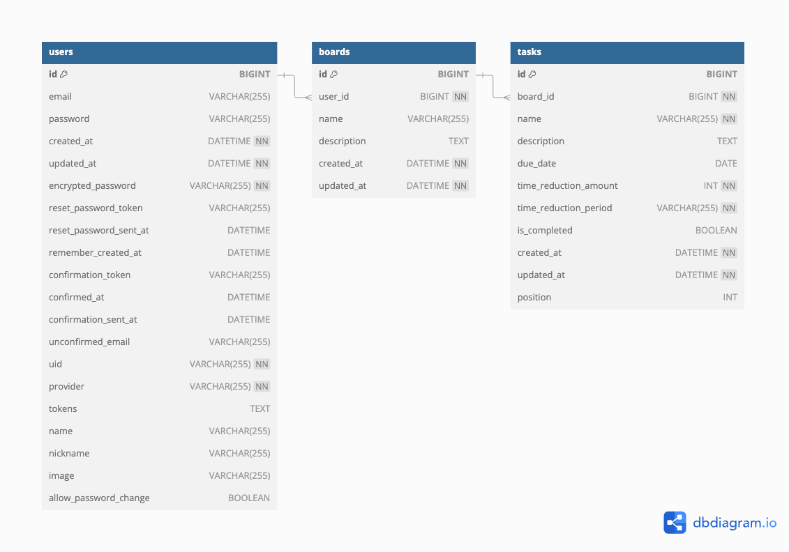
データベースは下記3つの主要テーブルで構成。
- users  
  認証情報を管理。メールアドレスに一意性制約を設定し認証情報の安全性を確保。
- boards  
  複数のタスクをグループとして管理。
- tasks  
  各タスクの詳細情報を管理。

それぞれのテーブルは、ユーザー、タスクグループ、タスクが一貫して紐づくようリレーションを保持しています。  
boardsテーブルとtasksテーブルの間には1対多のリレーションを設定しています。  

### 今後の課題
テストはスピードを優先し、curlコマンドを使用してAPIのステータス確認やレスポンス検証を行っていました。  
機能の拡張に伴い、今後はRSpecを使用して、ユーザー認証やAPIエンドポイントのレスポンス確認、リレーションの動作検証を中心にユニットテストや統合テストを実装します。  

---

## インフラ 
バックエンドAPIの実行にはAWSの各種サービスを利用し、拡張性・運用効率・セキュリティを重視したインフラを構築しました。  
AWSの構築が初めてだったため、フロントエンドの静的ファイルホスティングにはデプロイ速度が速く、簡易な管理が可能な**Vercel**を採用しました。  

### インフラ構成図
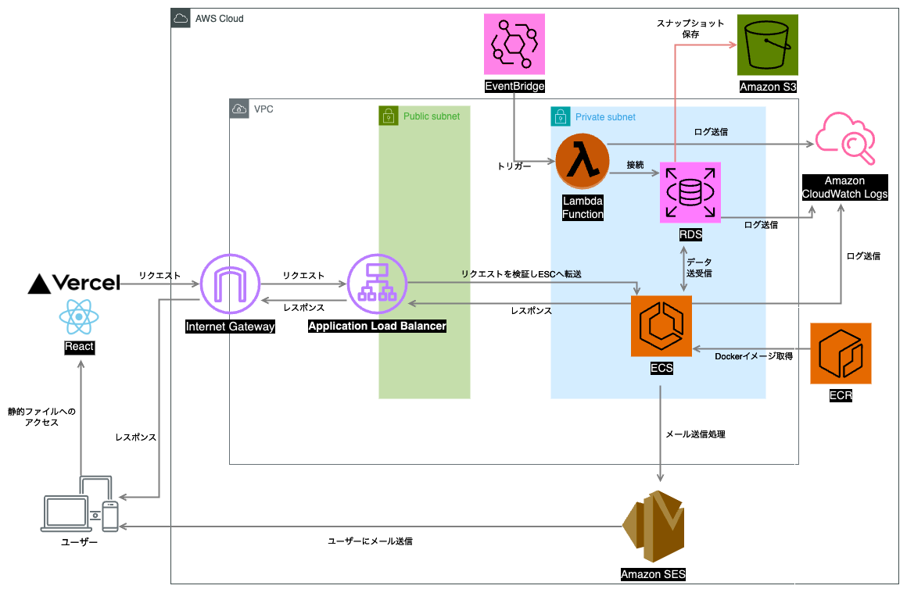
#### APIリクエストの処理の流れ
1. ユーザーはVercelにデプロイされたフロントエンドアプリケーションにアクセス。
2. APIリクエストは、パブリックサブネット内のALB (Application Load Balancer) を通じてバックエンドに送信。
3. ALBは、ECS (Elastic Container Service) によって管理されるRailsアプリケーションにリクエストを転送。
4. ECSは、以下の処理を実行：
   - RDSへのデータベースアクセス。
   - Amazon SESを利用したメール送信。
   - CloudWatchにログを送信し、監視・管理を実施。

### 主な使用技術
- **ECS (Elastic Container Service) ＋ ECR (Elastic Container Registry)**  
  コンテナ化されたAPIサーバーを効率的にデプロイ・スケーリングし、最新のDockerイメージを管理。
- **RDS (Aurora MySQL)**  
  高い可用性とスケーラビリティを持つリレーショナルデータベースでデータ整合性を重視。
- **S3 (Simple Storage Service)**  
 静的ファイルやRDSスナップショットを保存し、高耐久性のストレージとして活用。
- **ALB (Application Load Balancer)**  
 フロントエンドからのリクエストをECSタスクに分散し、スケーラビリティとパフォーマンスを最適化。
- **CloudWatch**  
 リアルタイム監視とログ管理で障害検知を迅速化。
- **AWS Lambda**
   - Node.jsによる未認証ユーザーの定期削除
     - トリガー: EventBridgeで1日1回実行。
     - 処理内容: データベースに接続し、一定期間が経過した未認証ユーザーを削除。
   - PythonによるRDSスナップショットのS3への自動エクスポート
     - トリガー: EventBridgeで１日１回実行。
     - 処理内容: 古いスナップショットの削除、新しいスナップショットの作成とS3へのエクスポート。
- **Vercel**  
  フロントエンドの静的ファイルをホスティングし、高速なCDN配信を実現。  
- **IAM (Identity and Access Management)**  
  最小権限のアクセス権限をECSやRDSに付与することでセキュリティを強化。
- **Amazon SES (Simple Email Service)**    
  カスタムドメインからメール送信を実現。
- **Certificate Manager**  
  SSL/TLS証明書を発行し、ALB経由でHTTPS通信を実現。
- **Secrets Manager**  
  データベース接続情報やRailsの暗号化キーを管理し、環境変数として安全に利用。
- **VPC (Virtual Private Cloud) + サブネット構成**  
  VPC内でパブリックサブネットにALBを配置、プライベートサブネットにRDSやECSタスクを配置することで、外部アクセスを制限し安全な通信を実現。
- **Step Functions**
  ECSとRDSの起動・停止をスケジュールして運用コストを削減。
  
### 今後の課題
フロントエンドの静的ファイルもAWS（S3＋CloudFront）にデプロイし、AWSリソースでの一元管理を目指します。  
まだ、CICDを設定していなかったので、GitHub ActionsやCodePipelineによるAWSへの自動デプロイの実装に挑戦したいと考えています。

## アプリ画面
### ホーム
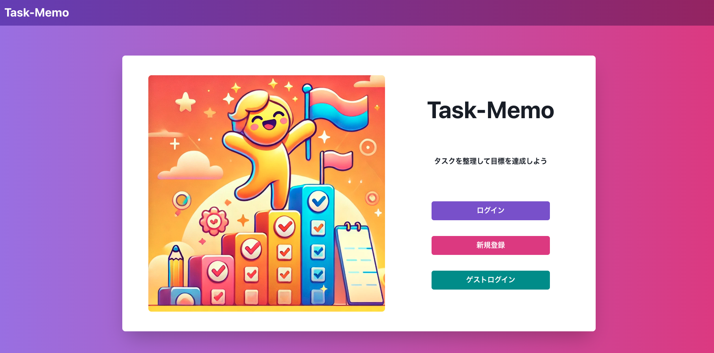
### 認証関連
#### ゲストログイン
登録不要で簡単にアプリの機能を試せるため、初めてのユーザーでも操作を気軽に体験できます。  
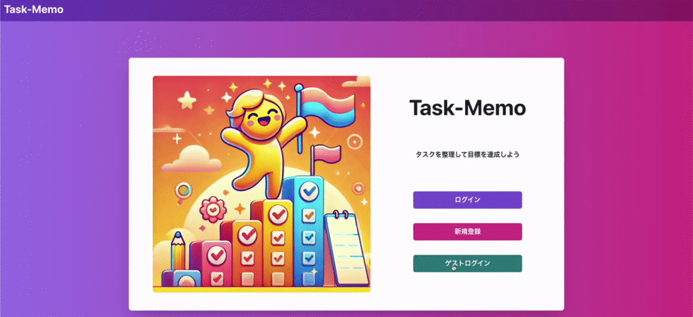
#### ログイン
入力時と送信時にバリデーションを行い、セキュリティとユーザー体験を向上させています。
- 入力時バリデーション
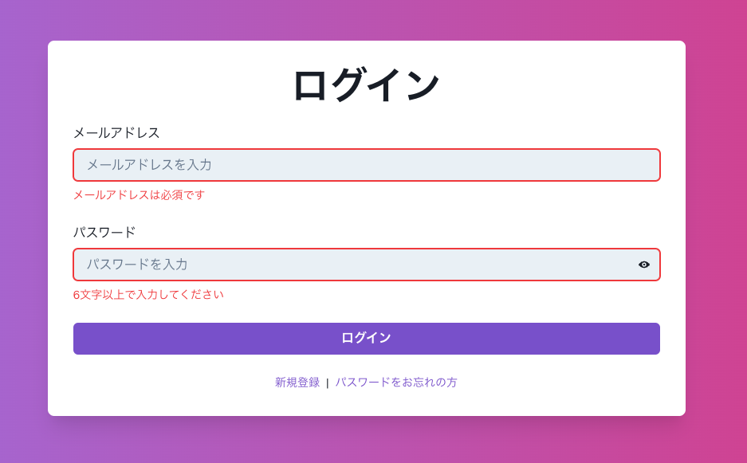
- 送信時バリデーション
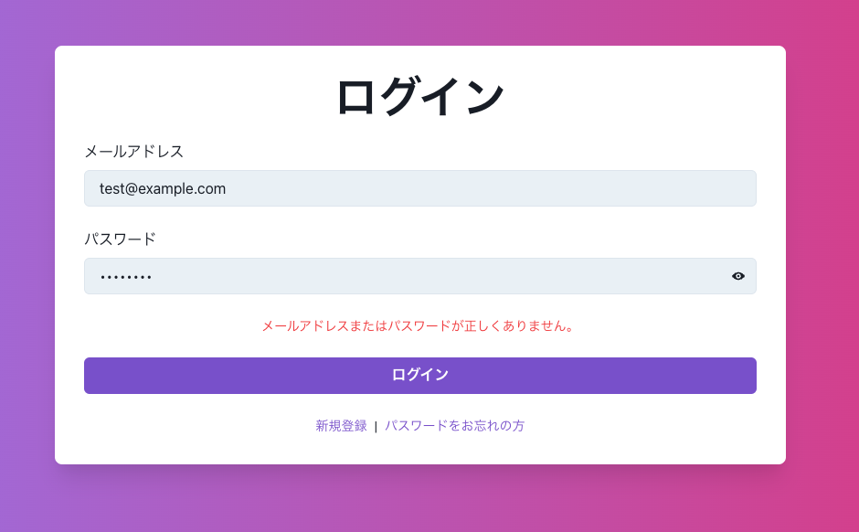
#### ユーザー登録
入力時と送信時にバリデーションを行い、セキュリティとユーザー体験を向上させています。
- 入力時バリデーション
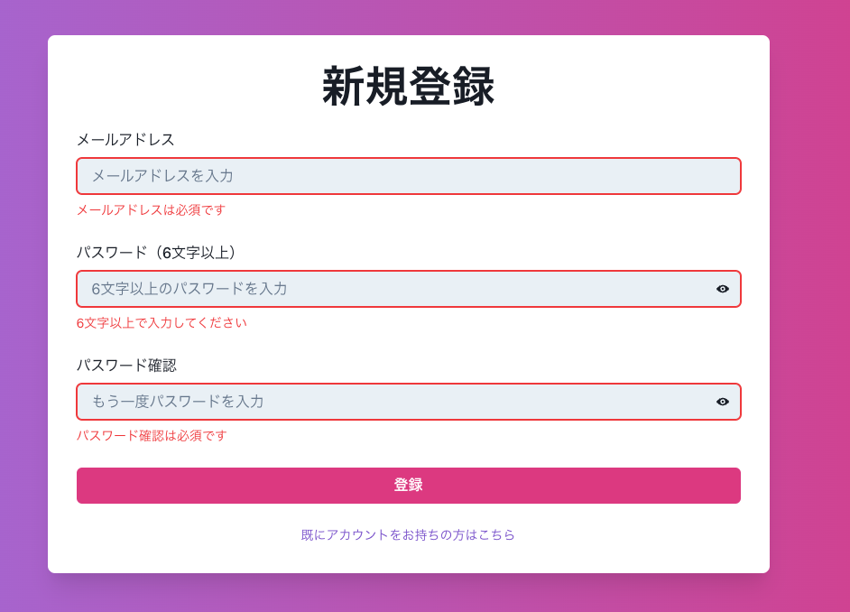
- 送信時バリデーション

#### メールアドレス認証
- 認証確認通知
登録リクエスト送信時に、一定時間内に認証が必要なことを画面に表示します。
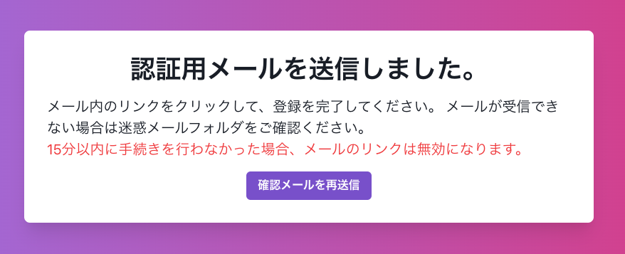
- 認証用メール
新規登録後に送信される認証リンク付きのメールを通じて、アカウントの有効性を確認します。
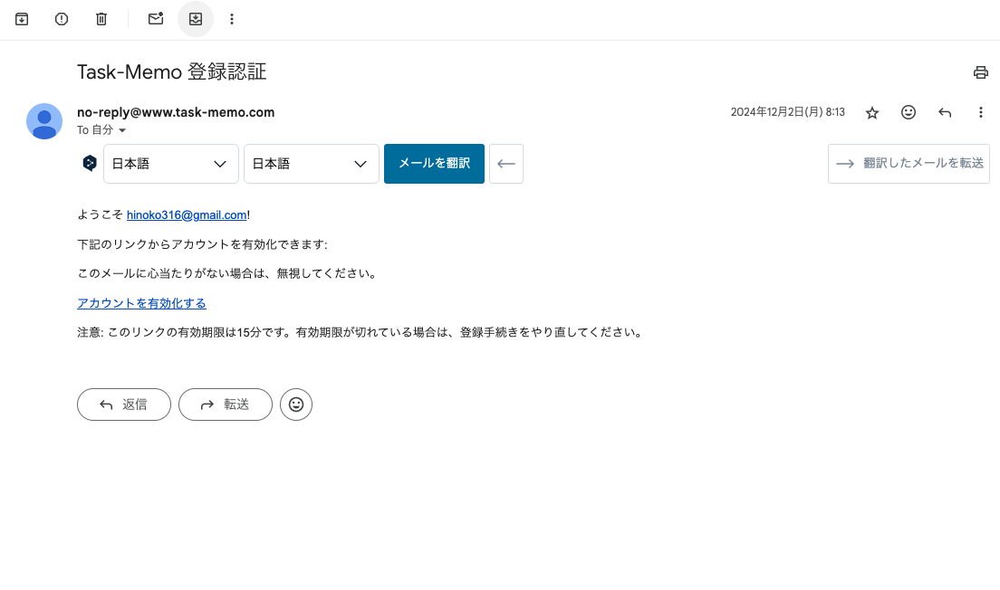
#### 認証メール再送信
認証メールの有効期限が切れたときに再送信を行えます。未登録のメールアドレスには送信できません。
 - 送信時バリデーション
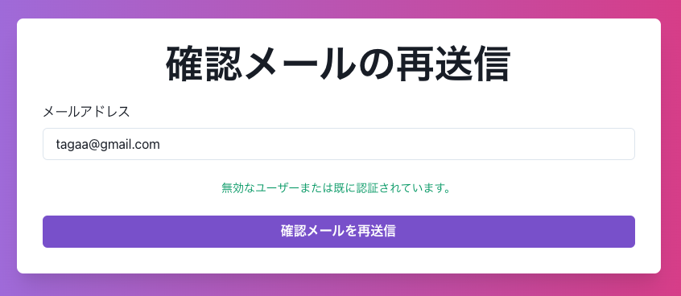
#### パスワードリセット
パスワードを忘れた場合に再設定リクエストを送信できます。
- 再設定リクエスト入力時バリデーション
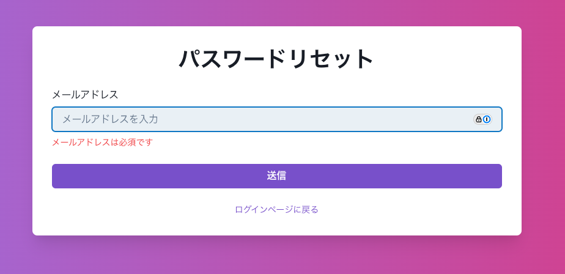
- リクエスト送信時バリデーション
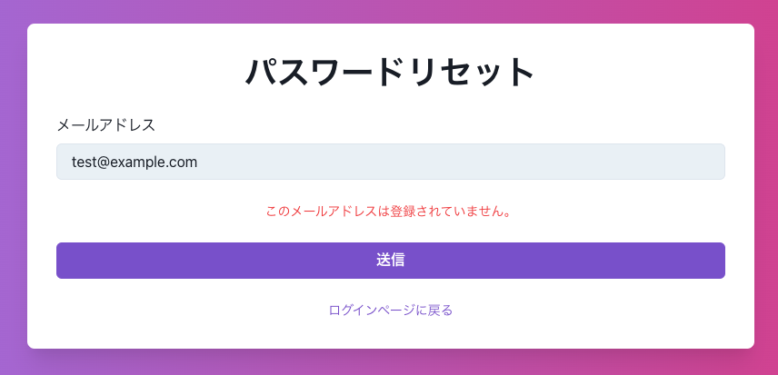
- 再設定用メール
リンク付きメールを送信し、パスワード再設定画面へ案内します。
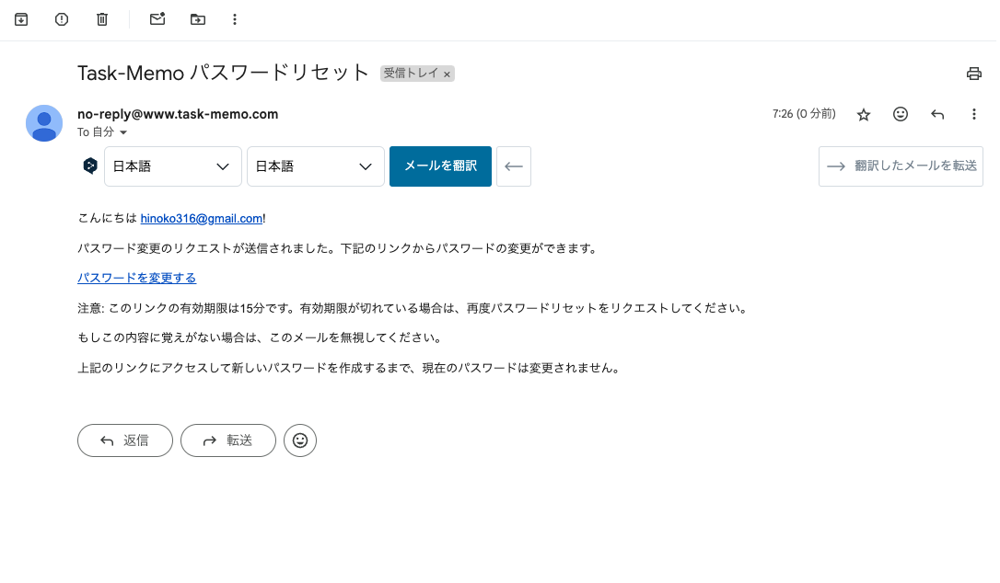
- 再設定画面入力時バリデーション
再設定用のリンクをクリックすると開くことができる再設定画面で、新しいパスワードを設定します。
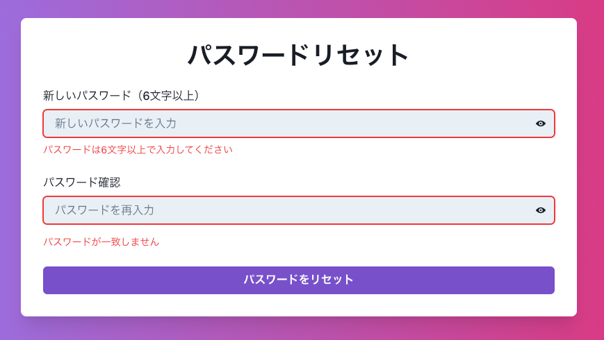


### タスク管理
#### ボードCRUD
ボード（タスクグループ）の作成、編集、削除が簡単に行えます。  
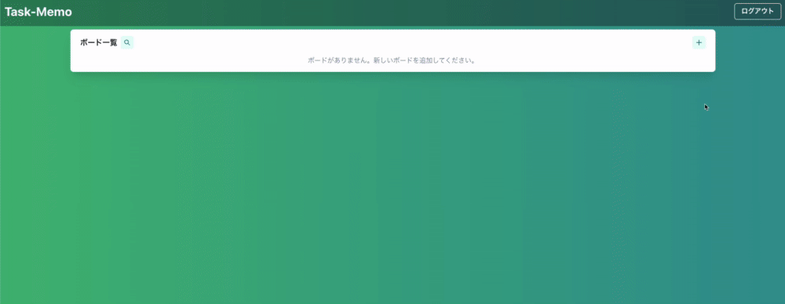
#### タスクCRUD
タスクの作成、編集、削除が簡単に行えます。 
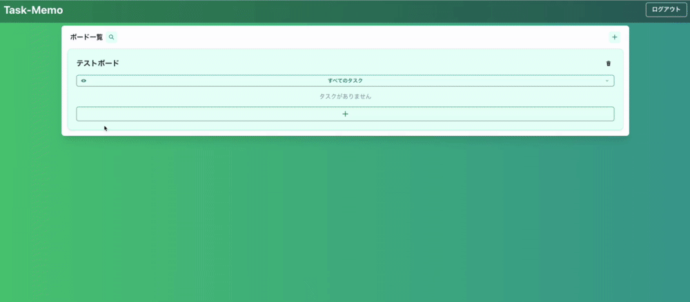
#### 検索
検索バーを使用して、特定の単語を含むボードを抽出することができます。  
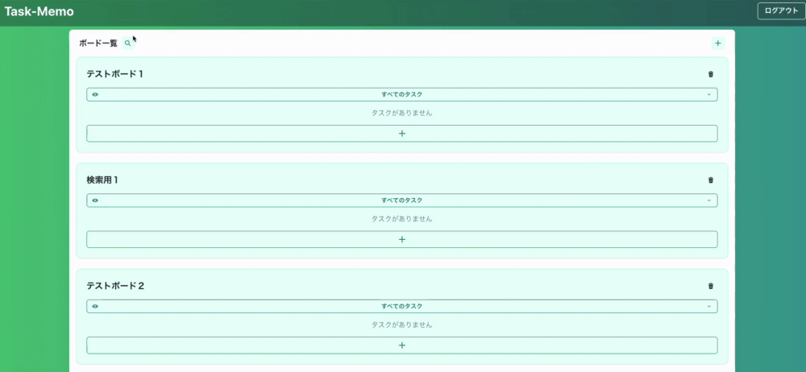
#### 絞り込み
フィルター機能を活用して、完了・未完了のステータス別にタスクを絞り込めます。  
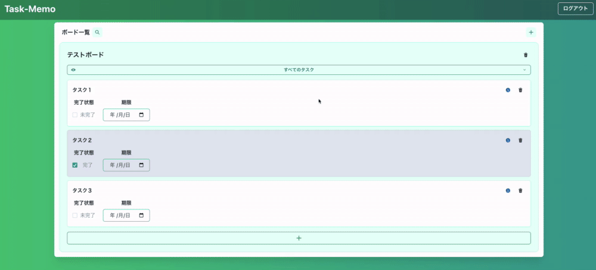
#### 並び替え
直感的な操作でタスクの優先順位を調整できます。
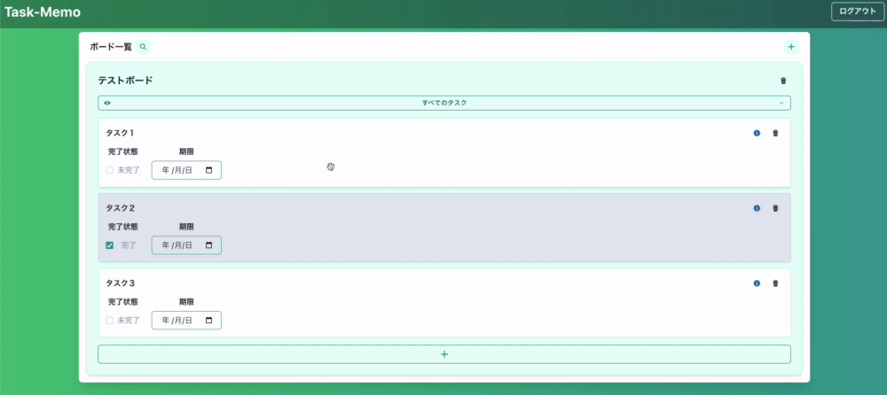

## 開発記録
開発中に苦労した部分や学んだことをQiitaで記事にしています。  
項目ごとの主要な

### 開発環境
- [モノレポ構成でつまづいたリバースプロキシとCORSの問題](https://qiita.com/kumazaki-y/items/7acbbfdbac9a838477a1)  
  モノレポ環境でのリバースプロキシ設定不備やCORS設定の見直しによる、API連携やCookie認証問題の解決手順を記録。
- [Vite×ReactのビルドをDockerで行ったときに出たエラー](https://qiita.com/kumazaki-y/items/9faf6ab4712d4c6e5c72)  
  Docker環境でViteの依存関係（ARM64向けモジュール）が原因で発生したエラーの調査・解決手順を記録。

### フロントエンド
- [eslintrc.jsonのproject設定でtsconfig.jsonが読みこなかったケース](https://qiita.com/kumazaki-y/items/b8c3b887a236a2465b5f)  
  ESLintの設定で発生したエラーを調査し、tsconfig.jsonの構造変更で解決。
- [TypeScript　typeof keyof valueofについて](https://qiita.com/kumazaki-y/items/aeae9109177fc0bdf2d2)  
  型情報の取得やユニオン型生成の基本的な使い方をまとめたメモ。

### バックエンド
- [devise_token_authを用いたパスワードリセット機能の実装](https://qiita.com/kumazaki-y/items/b2d3323f75339973c601)  
  ライブラリの仕様を調査し、ヘッダーにトークン情報を含めることでリクエスト失敗を解決。
- [Railsの仕様によるエラーの解決方法](https://qiita.com/kumazaki-y/items/d0022892a93141619ece)  
  Rails７のAPIモードで発生したエラーの記録。  
  名前空間に対応したコントローラーの設定方法、存在しないアクションによるコールバックエラーを解決。

### インフラ
- [AWSの構築記録](https://qiita.com/kumazaki-y/items/dc8c9270a6b73df1a765)  
  AWS構築作業の再現性を高めるために参考記事を記録。運用コスト削減やハマった点も記録。
- [未認証ユーザー自動削除機能の実装手順：Lambda と EventBridge を活用した自動化](https://qiita.com/kumazaki-y/items/d430bb834d957b66b03d)  
  Secrets Manager で安全に認証情報を管理しながら、RDS データベース内の未認証ユーザーを自動削除する仕組みを構築。  
  VPC やセキュリティグループ設定、ARN の指定などの課題とその解決手順を記録。

